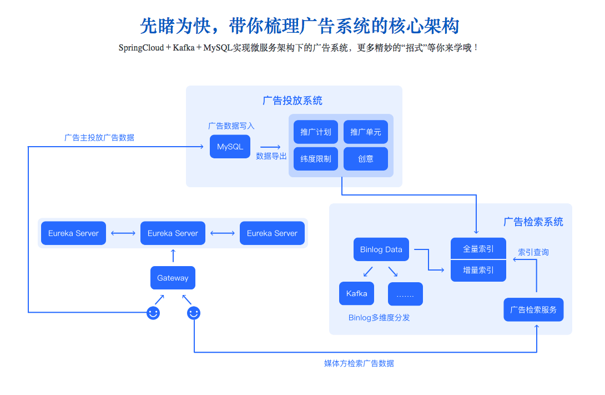

# 基于 Spring Cloud 微服务架构下广告系统设计与实现

广告系统是互联网公司中的必备知识体系，但是关于怎样设计、实现广告系统的资料、课程却非常稀少 。本课程将从零开始逐步实现广告系统中最为核心的两个模块：广告投放系统与广告检索系统，并测试它们的可用性，让你在实战中学习广告系统的设计思想，实现方法，掌握这项各大公司都极为重视的技术

### 系统架构

### 环境参数

- JDK 1.8 
- SpringCloud: Greenwich.RELEASE 
- Kafka 2.0 
- Maven 3.5.0 
- MySQL 8.0.12 
- IntelliJ IDEA: 2019.1

### 内容

#### 广告系统设计思想

- 对外服务统一入口 
- 广告主投放广告模块 
- 媒体方检索广告模块

#### 技术架构设计

- 广告系统架构设计 
- 广告数据存储设计 
- 广告数据索引设计 
- 广告匹配策略设计

#### 微服务体系搭建

- 服务注册平台搭建 
- 服务网关搭建 
- 业务系统搭建

#### 广告投放编码实现

- 数据存储设计 
- ORM服务接口实现 
- 响应与异常统一实现

#### 广告检索编码实现

- 数据索引设计 
- 全量索引加载 
- 增量数据的构造与投递 
- 检索服务实现

#### 广告系统功能测试

- mock测试数据 
- 应用服务接口测试 
- 各模块HTTP接口测试
